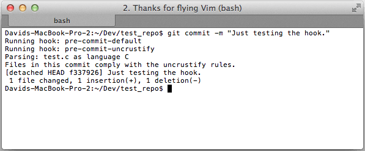

This repository contains some useful and documented pre-commit hooks to use with git.

## Table of contents

* [Included hooks](#included-hooks)
* [Features](#features)
* [Usage Example](#usage-example)
* [Installation](#installation)
* [Contributions](#contributions)
* [License](#license)

## Included hooks

hook | description
------------ | -------------
[pre-commit](pre-commit) | Allow to run multiple pre-commit hooks as specified in the script.
[pre-commit-compile](pre-commit-compile) | Compile the project and abort commit if it fails.
[pre-commit-uncrustify](pre-commit-uncrustify) | Run [Uncrustify](http://uncrustify.sourceforge.net/) on your sourcefiles and abort the commit if style violations have been detected. Generate a patch to fix these violations.

## Features

* Shell agnostic, should work with any Posix compliant shell
* Robust against whitespaces and special characters in file names and directories
* Tested on Linux and Mac OS
* The hooks can easily be extended and run side by side with existing ones

## Usage example

Sometimes pictures say more than a thousand words. Below is an exemplary workflow using the [Uncrustify](http://uncrustify.sourceforge.net/) hook.

* Add or edit a file and work on some code


* Stage changes


* Attempt to commit changes


* Apply the automatically created patch to fix the formatting


* Commit again



## Installation

1. Clone the repository

    ```
    git clone git://github.com/githubbrowser/Pre-commit-hooks.git
    ```

2. Every script has a section named `CONFIGURATION` at the top. Here you will find relevant configuration options. Update the configuration section in `install_hooks.sh` with the hooks that you want to install.

3. Copy the pre-commit hooks into your repository. Note that the script will ask before overwriting any existing hooks.

    ```
    ./install_hooks.sh /path/to/repository
    ```

4. The pre-commit hooks live in the `.git/hooks` subdirectory of your git repository. Update their configuration sections if required and you are good to go. By default the hooks will abort the commit and print a notice if any required configuration is missing.

5. Work on your code as usual and the hooks should be run automatically when calling `git commit`.

6. Profit!

## Contributions

Thanks to [everyone](https://github.com/githubbrowser/Pre-commit-hooks/graphs/contributors) who contributed with fixes, ideas and extensions!

Feel free to open issues or pull requests if you come across something that can be improved or does not work. Input is always appreciated.

## License

Licensed as per [LICENSE file](LICENSE).
